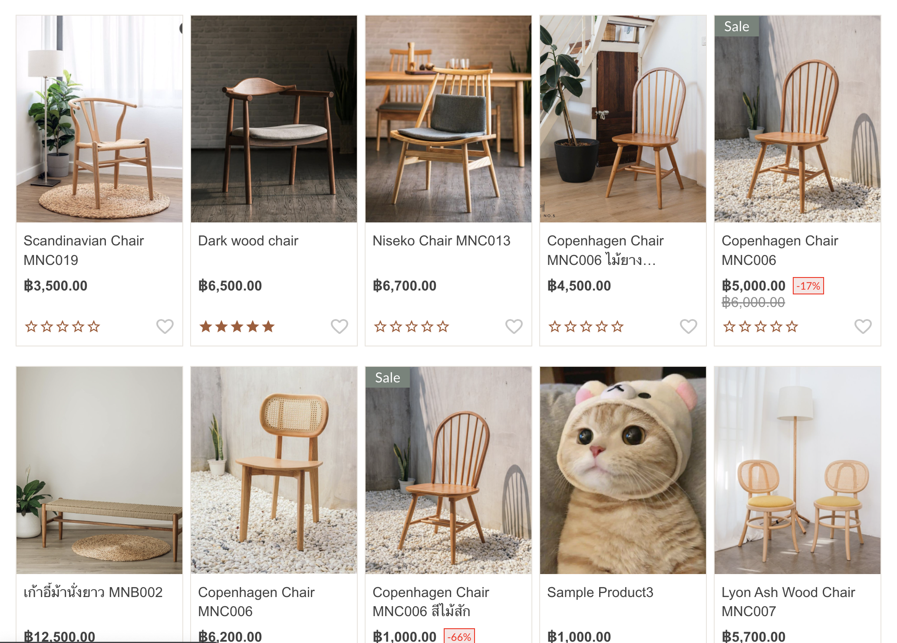
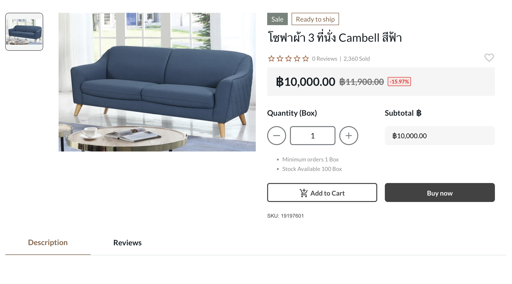

# My Store

As a store owner I would like to have ecommerce website where I can show all my available products and product detail online

in this proeject we already have product list page with bad layout so we would like to have better products page as well as when user click on any product they can see more detail of that product

 

## Instruction

- Checkout main branch
- run yarn install
- run yarn run json-server --watch db.json
- run yarn start

 

## Assignment

- Apply any UI framwork (mui, ant, tailwind or any you prefer) to make sure our website look better
- Add new product page allow user to see more product detail when user click on any product on product list page
- Refactor code to clean up some bad code (if possible)

 

## More information

- get specific product by id `http://localhost:3000/products/{id}`

## Example Design

- 
- 
